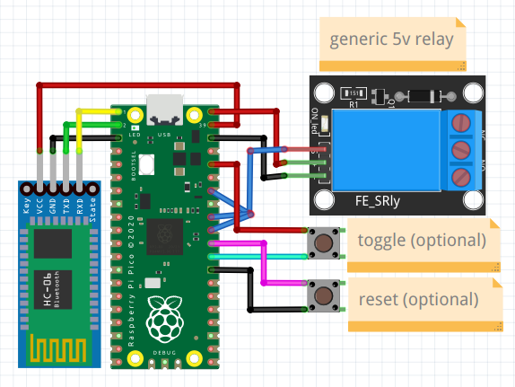

# Bluetooth lightswitch
The goal of this project is to create remote control capability for a lightswitch in a room without depending on line-of-sight or the uptime of a LAN. All while maintaining normal functionality of the lightswitch.
Bluetooth is perfect for this.

The project consists of two parts: the actual hardware in the wall, and the somewhat optional custom app to control it with.

This documentation is intended as an overview, not necessarily as a strict roadmap to be follwed exactly as I did it.
## Hardware
The hardware consists of a Raspberry PiPico with a bluetooth daughterboard (I used an HC-06) and a relay and a USB power source all embedded inside the electrical box where the switch is. This can get rather tight and in my case I had to replace the existing 1 gang box with a 2 gang box to make things fit. The switch itself had to be replaced with a 3-way switch and the relay (mounted right behind the switch) acts as the other switch in the set. If either is toggled, the lights change state.  
  
Gif by Cburnett, CC BY-SA 3.0, https://commons.wikimedia.org/w/index.php?curid=2426609

### PiPico
I used an original PiPico (not the W version) because that's all that was out at the time. It's possible the PiPicoW will soon have bluetooth support turned on, need to revisit when that happens.
### Bluetooth board
I used an HC-06 board. To change the device name and pin use the commented out code in the vicinity of line 30 in `main.py`
### Relay
Get a relay board, not just a raw relay. Make sure the relay is rated to handle wall voltage (120VAC) and that the board runs on 5vDC (eg. not 12v) since that's available on the PiPico directly from USB power.
Relay boards come in various configurations. Some want a constant signal to hold the relay closed, and release it when the signal goes low. Others toggle on or off when a pulse comes along the signal wire. On with an off pulse, or off with an on pulse. Some even have a jumper to change how they behave. What pin you connect the signal line to depends on how your board works. (blue wire in the diagram). See `main.py` (line 13-ish) for what's what.

### USB Power
I tried to find/build various ways to turn 120vAC into 5vDC but the safest, easiest way is to get the smallest USB wall brick you can find (like what apple makes) and the smallest 2 prong socket (like something cut off the end of a string of holiday lights) and wire up a plug inside the gang box. Some setups are harder/impossible to get 120v power from witout making the lights be always on. Hope you don't have one of those setups.
### 2 Gang Box
My 1 gang box didnt have enough room to cram all this inside so I had to replace it with a 2 gang box [like this](https://www.youtube.com/watch?v=1bre8JtsUXI). Other styles of old work box exist, you can find videos on how to install them if needed.
#### Faceplate
I got a 2 switch plate and a filler for the unused one because those are easier to find than a switch and blank. Plus "switch and blank" plates have screw placement that is unpleasing.
### 3 Way Switch
Try to get one that has minimal volume in back to leave room for the relay.
### Wires and connectors
For wires, I happened to find a couple feet of scrap Romex on the side of the road so I used some of the 14 gauge from that to wire the relay to my 3 way switch.  
For connectors, do yourself a favor and get Wago lever nuts. Twist nuts and other garbage can work too.
## App
To remotely toggle the relay you need an app that sends the charater '1' over bluetooth.  
[Serial Bluetooth Terminal](https://play.google.com/store/apps/details?id=de.kai_morich.serial_bluetooth_terminal&hl=en_US&gl=US) is good enough to get started. You can set one of the buttons at the bottom to read [Toggle] and make it send a '1'.  
Or you can use the app I slapped together in [AppInventor](http://ai2.appinventor.mit.edu).